# User Manual - Heads Up Poker

## Game Rules
Heads Up 1v1 Poker, is a variant of traditional poker where two players compete against each other directly, as opposed to a full table of players. In this game, each player is dealt
 cards from a standard 52-card deck, and the objective is to win money by either having the best hand at showdown or by forcing the opponent to fold. Hands are determined from a 
 combination of community cards and 'pocket' cards. Community cards are the 5 cards in the middle of the table that slowly get revealed as the game progresses. Pocket cards are the 
 two cards unique to each player.

Additionally there are also forced bets called big and little blinds. These bets are used to stimulate action and ensure there is money in the pot for players to compete for. Big blind 
and little blind positions in Heads Up Poker will switch every hand to ensure fairness. Big blind bet is twice as much as the little blind bet. Both players must place these predetermined 
amount of chips into the pot before seeing their cards. Following this, if the little 
blind player decides they want to play the hand, they must call the big blind amount.

For example,
Big blind is 1000 chips and Small blind is 500 Chips. If Small blind decides they want to play the hand, they must bet another 500 chips so they match the Big blind amount. Due to this 
fact, small blind will always be first to play.

The rules of Heads Up Poker also state that these mandatory bets increase in amount after every hand. Big blind will start at 200, and Small blind will start at 100. After each hand, 
Big blind will increment by 200, while Small blind will increment by 100.

### Hand Strength Rankings
Below is a ranking of different hand strengths with 10 (Royal Flush) being the strongest and 1 (High Card) being the weakest.

        Royal Flush --- 10
        Straight Flush --- 9
        Four of a Kind --- 8
        Full House --- 7
        Flush --- 6
        Straight --- 5
        Three of a Kind --- 4
        Two pair --- 3
        Pair --- 2
        High Card --- 1
### Hand Descriptions
    Royal Flush (Rank 10):
        A Royal Flush is the highest-ranking hand in poker and consists of the following five cards: Ace, King, Queen, Jack, and 10, all of the same suit.
        Example: A♠K♠Q♠J♠10♠

    Straight Flush (Rank 9):
        A Straight Flush is a hand that contains five cards of sequential rank, all of the same suit.
        Example: 8♣9♣10♣J♣Q♣

    Four of a Kind (Rank 8):
        Four of a Kind, also known as quads, is a hand that contains four cards of the same rank, plus one side card or 'kicker.'
        Example: 7♠7♣7♦7♥K♠

    Full House (Rank 7):
        A Full House is a hand that contains three cards of one rank and two cards of another rank.
        Example: 9♦9♣9♠K♦K♣

    Flush (Rank 6):
        A Flush is a hand where all five cards are of the same suit, but not in sequence.
        Example: 2♠6♠8♠J♠Q♠

    Straight (Rank 5):
        A Straight is a hand that contains five cards of sequential rank in at least two different suits.
        Example: 4♥5♠6♦7♣8♠

    Three of a Kind (Rank 4):
        Three of a Kind, also known as trips or a set, is a hand that contains three cards of the same rank and two unrelated side cards.
        Example: 10♠10♣10♦3♠8♣

    Two Pair (Rank 3):
        A Two Pair hand contains two cards of one rank, two cards of another rank, and one side card or 'kicker.'
        Example: Q♠Q♣9♦9♠4♣

    Pair (Rank 2):
        A Pair is a hand that contains two cards of the same rank, plus three other cards that do not match each other.
        Example: A♣A♠3♦7♣J♠

    High Card (Rank 1):
        High Card is the lowest-ranking hand in poker and occurs when no other hand is made. It's simply the highest card in a player's hand.
        Example: A♠K♣8♦5♠3♣ (Ace is the highest card)

### Case: Players Have Hands of the Same Ranking
If both players have the same strength of hand, (e.g both have a pair), the winner will be determine by other factors. If a winner still can not be determined from these factors, the result 
will be a split pot. Since it is 1v1 Poker, this just means that both players will keep their bets, (No-one loses or wins money). The additional determining factors for winning a hand can 
vary between different hand rankings.

    High Card: 
    If both players have no pairs or other combinations, the player with the highest card wins. If the highest cards are equal, the next highest cards are compared, and so on until a winner 
    is determined. If both players have the same pocket cards, the result is a split pot.

    Pair: 
    If two players both have a pair, the player with the highest pair wins. If both pairs are equal, the player with the highest-ranking side card (kicker) wins. If the kickers are also the 
    same, the pot is split.

    Two Pair: 
    When comparing two hands with two pairs, the hand with the highest pair wins. If both players have the same highest pair, the second pair is considered. If both pairs are equal, the player
    with the highest-ranking kicker wins. If the kickers are also the same, the pot is split.

    Three of a Kind: 
    The player with the highest-ranking three of a kind wins. If both players have the same three of a kind, the highest-ranking kicker determines the winner.

    Straight: 
    The player with the higher straight will be the winner. For example, if player A had straight [3,4,5,6,7] and Player B had straight [4,5,6,7,8], Player B would be the winner. If both players 
    have the same straight, the pot will be split.

    Flush:
    The player with the higher card in their flush will be determined to be the winner. For example if two players both had diamond flushes, but Player A's flush was cards [2,4,5,7,9] and 
    Player B's flush cards were [2,4,5,7,11], Player B would be the winner. If both players have same flush cards, pot is split.

    Full House: 
    In a Full House scenario, the player with the highest-ranking set of three cards (known as the "three of a kind") wins. For instance, if Player A has three Kings and two Queens (KKKQQ) 
    and Player B has three Queens and two Kings (QQQKK), Player A would win since Kings are higher ranking than Queens.
    If both players have the same three of a kind (for example, both have three Kings), the player with the highest-ranking pair wins. If the pairs are also identical, the pot is split.

    Four of a Kind:
    In the case of Four of a Kind, the player with the highest-ranking set of four cards wins. For instance, if Player A has four Aces and Player B has four Kings, Player A would win as Aces 
    rank higher than Kings.
    If both players have the same four of a kind (for example, both have four Aces), the player with the highest-ranking kicker wins. If the kickers are also identical, the pot is split.

    Straight Flush, Royal Flush: 
    These hands don't typically result in ties between players because of the rarity of such occurrences, except for in the case where this hand is located entirely in the community cards, 
    in which case the pot would be split.

## Game UI - How to Play
Gameplay is done through clicking various buttons available on the game display.
### Title Screen
The Title Screen contains three different buttons available to the player:

**Start:**
This Starts the game. It will bring you out of the title screen into the actual game with a dealt hand and chips.

**Settings:**
This will bring you to the settings screen, which will be explained in more depth below.

**Quit:**
This will stop the running of the Heads Up Poker Game.

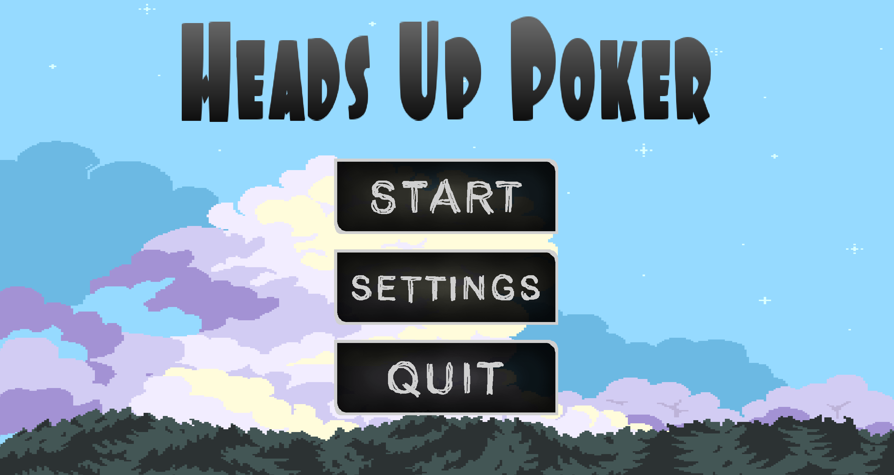
### Game Screen
The game screen contains different display's and actions the players can use to interact with the game. 

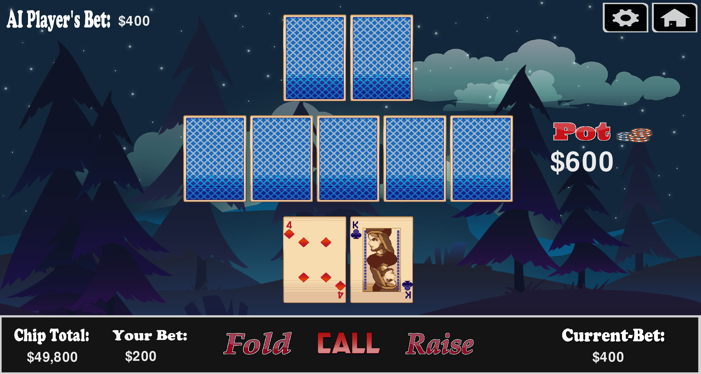
## Check, Call, Raise and Fold Buttons
There are 6 different buttons the player can use during gameplay. The main ones are the Check, Call, Raise and Fold Buttons:

**Fold Button:**
    The player will fold the hand and lose any chips they have already betted. The AI will win the hand.

**Check Button:**
    The player does not want to raise or fold, they want to keep the bet the same and reveal more cards.

**Raise Button:**
    The player wants to increase the current bet. The minimum increase is 100 chips and the maximum is for the player to
    bet all their chips and go 'All In'. Once a player clicks on this button, they will be brought to the raise screen shown
    below:
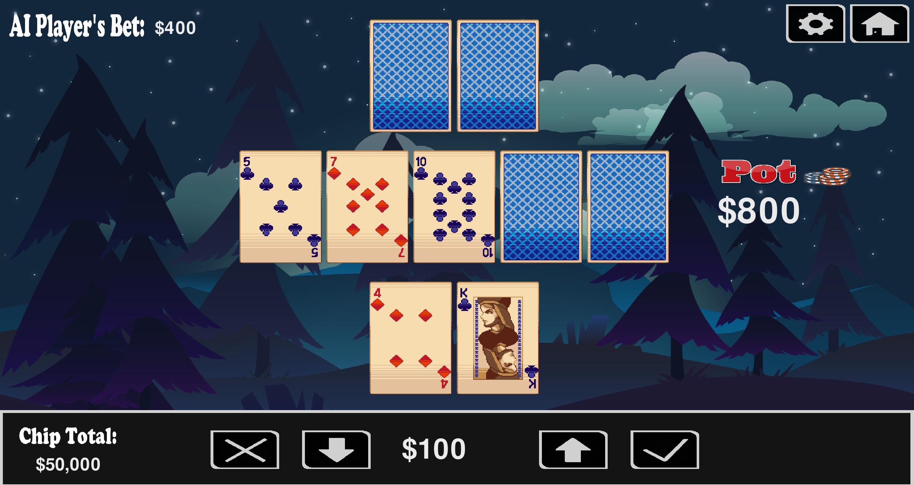
On this screen a player can increase and decrease their bets by clicking the 'up' arrow to increase raise and 'down' arrow to decrease 
raise. There are a few functionalities added to make it as easy as possible to change this ammount. The player can control the increase of
the raise through different mouse clicks

**Left Mouse Button:**
When using the Left Mouse Button to click on the arrows, the raise will increase/decrease 100 for each click.

**Right Mouse Button:**
When using the Right Mouse Button to click on the arrows, the raise will increase/decrease 1000 for each click.

**Middle Mouse Button:**
When clicking on 'up' arrow, this will maximise the raise amount the player can do.
When clicking on the 'down' arriw this will decrease the raise amount to the minimum of 100.

**Call Button:**
The Player will call the AI's bet. This means they want to bet the same amount as the AI has, (Don't want to raise or fold).

Its important to note that only three of these buttons are avaialble to a player at any one time. While Fold and Raise are always
available to the player, the Check and Call button availability is determined by the current situation in the game. If it is the player's
turn and their bet is the same as the AI, (The AI hasn't raised), the check button will be avaiable, (There is no bet to call).
However, if the player hasnt matched the AI's bet, the call button will be available, (As you cannot check when there is a raised bet).

**Call Button Available:**
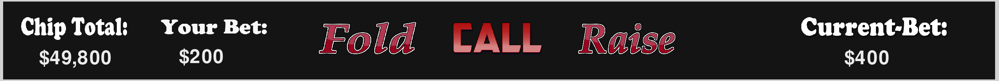

**Check Button Available:**
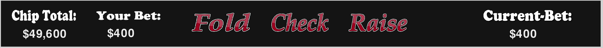

We can see check button is avaiable once the player's bet matches the current bet.

## Home and Settings Buttons
There are also a home and settings button avaialble to the player while their playing the game.

**Home Button:**
This button will bring the player back to the title screen

**Settings Button**
This button will bring the player to the Settings screen, and functions the same as the settings button on the title screen

## Display
There are also various infomation displays that the player will require to play the game. These are:

**AI Player's Bet:**
This displays how much chips the AI player is currently wagering

**Your Bet:**
This displays how much chips the player is currently wagering

**Current-Bet:**
This displays the current highest bet. If a player's bet does not match this, they will either have to fold, call, or re-raise it for the AI to match

**Chip Total:**
This displays how many chips the player has to bet with. Both the AI and the Player start with 50,000 chips each.

**Pot:**
This displays how much money is avaiable in the pot to win. It is a combination of the player and the ai's current bet.

## Cards
Finally there is the cards themselves. The two cards at the bottom are the players pocket, while the two at the top are the AI's pocket. The 5 cards in the middle
are the community cards that get revealed as the game progresses.
Initially only the player's pocket cards are shown, with all other cards face down. As shown previously above.

**The next state reveals three of the community cards**
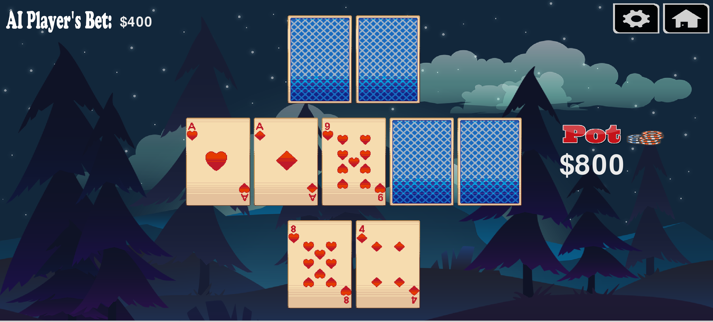

**The next state reveals an additional community card**
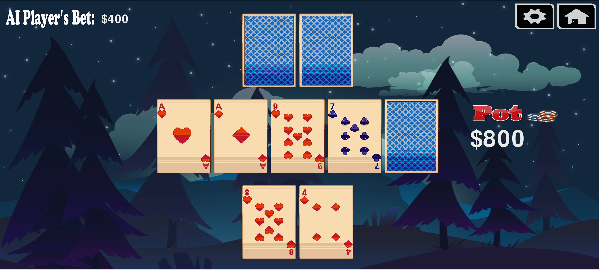

**The next state reveals the final community card**
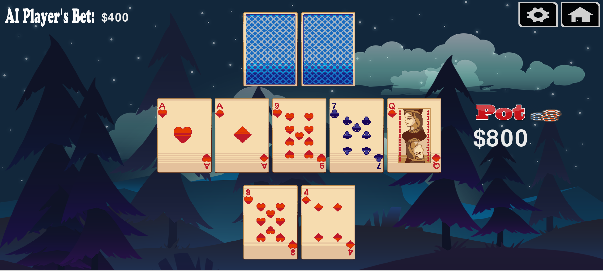

**Finally in the 'showdown' state, the AI's pocket is revealed and a winner determined.**
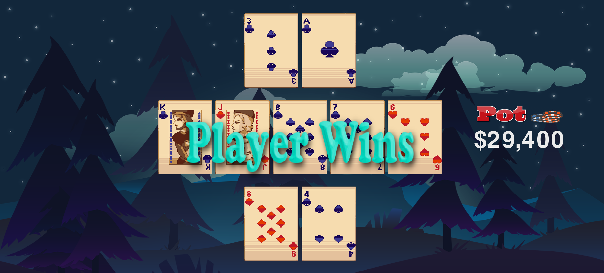

## Settings
The Settings screen contains different buttons that the user can press to alter the game in some way
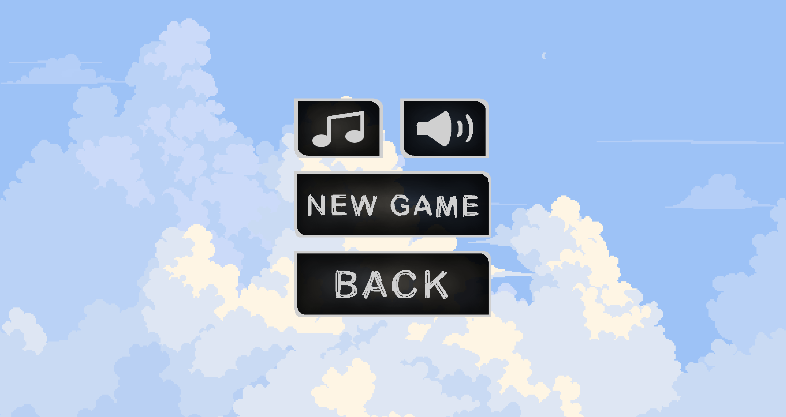

There is 4 different buttons avaiable:

**Music Button**
This Button allows the user to change the music being played during the game. It's important to note that this only changes
the music in the actual game itself, and does not alter the title screen music.

**Audio Button**
The Audio button allows the user to mute and unmute the game audio.

**Muted**:
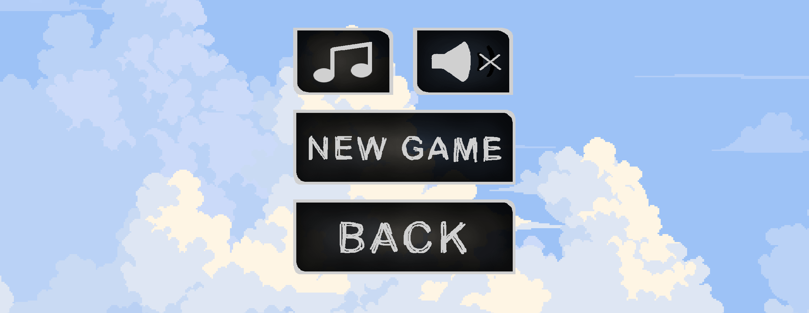
**Not Muted**: 

**New Game**
This Button will reset the game as if the player has just loaded it up. This means the Big blind and Little blind will be reset
to 200 and 100 respectively, and the Player and AI chips will be restored to 50,000

**Back**
This butotn will bring the user back to the previous page, whether that be the title screen if they clicked on Title Screen Settings, 
or the game itself if they clicked on the icon in the top right of the page.

## AI Opponent
The AI opponent uses a combination of a base strategy and a model to respond to in game scenarios. It looks at various differnet factors
such as the current bet, if the player has raised and by how much, strength of their hand and chance of improving it etc...
The AI's choice of move will be displayed on the screen for the player to see.

**AI RAISES:**
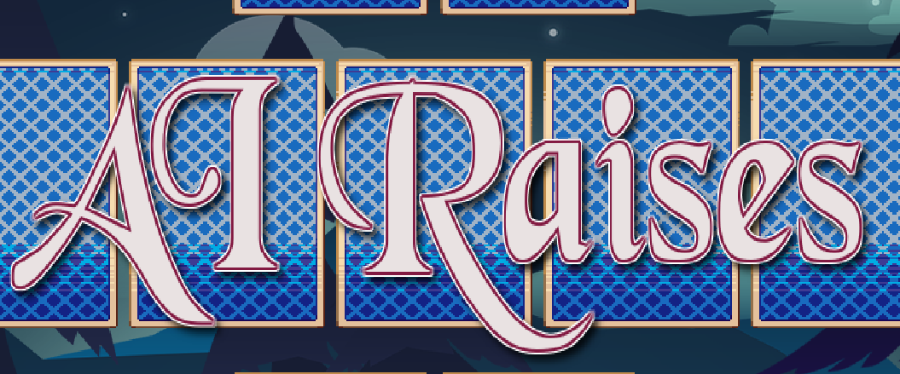

**AI CHECKS**
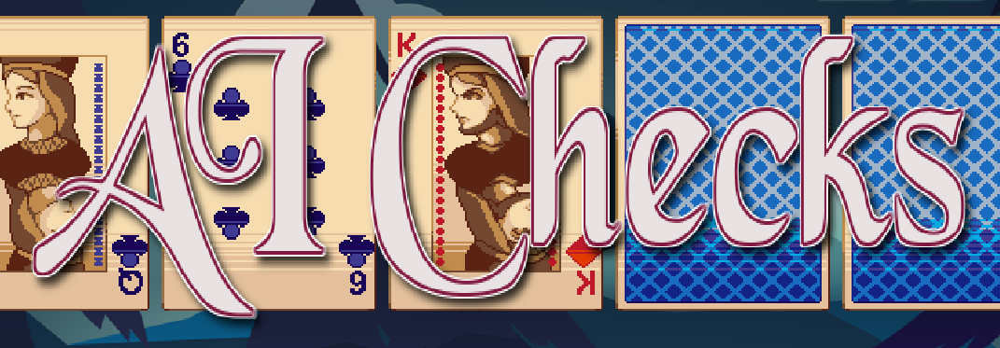

**AI FOLDS**
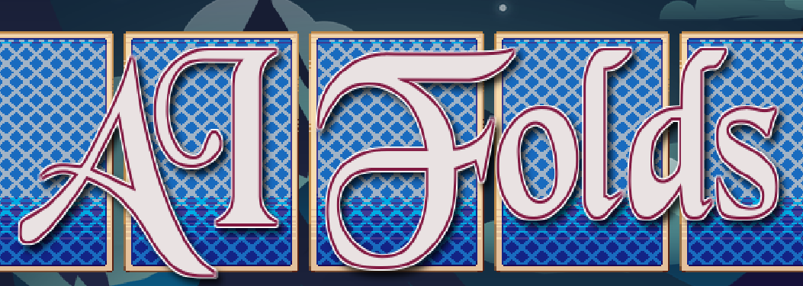

**AI ALL IN**
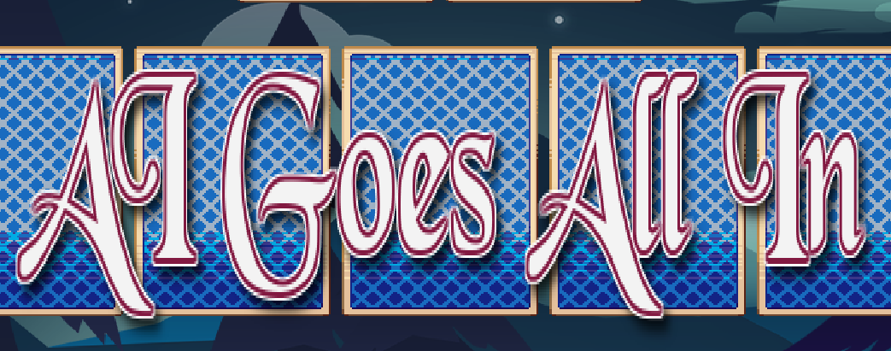